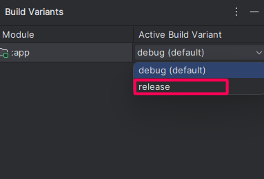
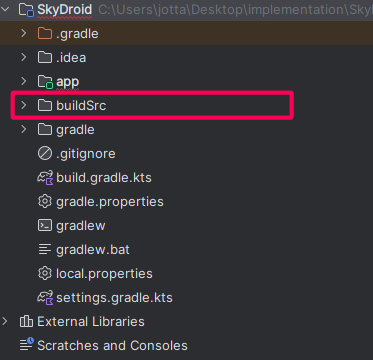
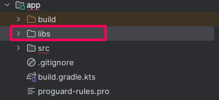
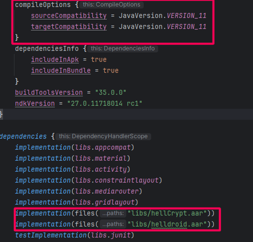
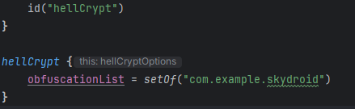
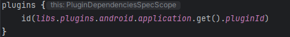
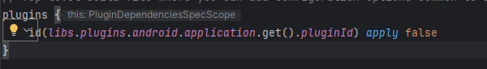
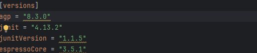

<h1 align="center">Helldroid</h1>

Helldroid is a RASP(Runtime Application Self-Protection) project  that integrate seamlessly with any Java-based application.

So the use of the language was necessary; We created the Helldroid class for certain checks to make patching/removal of the RASP more difficult, such as checking the stack traces of functions and importing functions from the native library for code obfuscation.

From it, we can call the functions of our RASP, developed as a native library in C/C++, which was used to create security features and modifications to the Android Runtime.

Currently, we focus on minimizing the use of LibC due to the ease of finding exports of functions when using a decompiler or DAST tools, which would allow us to hook the RASP and modify its behavior through these (LibC functions). Therefore, all these functions were recreated in Assembly, and we are currently in the process of implementing protections for these functions.

Finally, we use Kotlin and Gradle to build a plugin, making modifications at the bytecode level in the APK using Javassist and ASM, allowing us to perform encryption in the code and facilitating integration, while also opening up possibilities for other techniques such as control flow obfuscation or spreading ART hooking.

# Supported Architectures
Currently, our RASP supports x86_64 and ARM64/ARMv8-A architectures (focusing on 64-bit architectures). By concentrating on modern devices available in the current market, we ensure that our solution remains relevant and effective for the coming years. It is important to note that we will adapt the solution for older and/or legacy devices in the future.

# Detection Features
- <b>Anti-Root:</b> Su binary and Magisk (Zygisk detection is coming soon!)
- <b>Frida Detection:</b>  Executable memory and port scanning
- <b>Debugger Detection:</b> JWDP and Native dbg(LLDB and GDB)
- <b>Anti-memory Dump:</b> Monitoring maps, mem and pagemap of the process
- <b>Anti-hooking(checksum):</b> CRC32 of Native Lib using inline-assembly
- <b>Anti-virtual device:</b> QEMU, VirtualBox, Nox, Genymotion, Andy Emulator
# Obfuscation Techniques
- <b>Code Encryption:</b> Gradle Plugin + Reflection+ Proguard (Control Flow Obfuscation and ART spreading are coming soon!)
- <b>ART hooking:</b> Dynamic entrypoint rewriting on the receiver side
# Install/Use
1. Download our .zip on the <b><i>Releases</i></b> of this repo
2. Change your project for **Release Mode**
<p>
&nbsp;&nbsp;&nbsp;&nbsp;
</p>

3. Import the <b><i>buildSrc</i></b> folder in your root folder
<p>
&nbsp;&nbsp;&nbsp;&nbsp;
</p>

4. Import the <b><i>libs</i></b> folder to your main <b><i>app</i></b>
<p>
&nbsp;&nbsp;&nbsp;&nbsp;
</p>

5. Change your JVM version to **VERSION_11** and import both .aar(**hellCrypt.aar** and **helldroid.aar**)
<p>
&nbsp;&nbsp;&nbsp;&nbsp;
</p>

6. Add the gradle plugin to plugins and the **_hellCrypt_** configuration by passing the name of  the packages that you want do obfuscate(First your main app)
<p>
&nbsp;&nbsp;&nbsp;&nbsp;
</p>

7. Change the **_alias_** in your android application plugin to **_id_** and add **_.get().pluginId_** to the end:
<p>
&nbsp;&nbsp;&nbsp;&nbsp;
</p>

8. Do the same in your Project **_build.gradle.kts_**:
<p>
&nbsp;&nbsp;&nbsp;&nbsp;
</p>

9. And change your **_agp_** version in **_libs.versions.toml_** to 8.3.0:
<p>
&nbsp;&nbsp;&nbsp;&nbsp;
</p>

10. In your **_gradle.properties_**, add the line below:
```
android.injected.testOnly=false
```

11. Add the following code on your **_:app_** Gradle **_build.gradle.kts_**:
```
tasks.register("writeProguardRule") {  
    val proguardFile = file("proguard-rules.pro")  
  
    val mainApp = "com.sdk.helldroid"  
  
    doLast {  
        val ruleToAdd = """  
            -keep, allowoptimization public class com.lib.hellcrypt.hellcrypt {                public static void init();            }                        -keep, allowoptimization public class com.lib.hellcrypt.Stub {  
                public static final com.lib.hellcrypt.Stub instance;                public java.lang.String hellYoki(java.lang.String);            }                        -keep, allowoptimization public class com.lib.hellcrypt.hellDecrypt {  
                public static java.lang.String hellYoki(byte[]);            }                        -keep class sun.misc.Unsafe {  
                public native void putObject(java.lang.Object, long, java.lang.Object);                public long objectFieldOffset(java.lang.reflect.Field);            }            -keep, allowoptimization class $mainApp.MainActivity {  
                public native void ReplaceMethodByObject(java.lang.Object, java.lang.Object);            }                        -keepclasseswithmembers, allowoptimization class com.lib.helldroid.Helldroid {  
                native <methods>;            }                        -keepclassmembers, allowoptimization class com.lib.helldroid.Helldroid {  
                public static void LoadLibrary(android.content.Context, java.lang.Class);                public static void registerNativeMethods(java.lang.Class);                public static void createDummyFile(android.content.Context);                public static void checkMainTrace();            }                        -dontoptimize  
            -allowaccessmodification            -dontskipnonpubliclibraryclasses            -dontskipnonpubliclibraryclassmembers        """.trimIndent()  
  
        if (!proguardFile.exists()) {  
            proguardFile.createNewFile()  
        }  
  
        proguardFile.appendText("\n$ruleToAdd\n")  
        println("ProGuard rule written to proguard-rules.pro")  
    }  
}  
  
tasks.register("modifyManifest") {  
    val manifestFile = file("src/main/AndroidManifest.xml")  
  
    doLast {  
        if (!manifestFile.exists()) {  
            println("AndroidManifest.xml file does not exist.")  
            return@doLast  
        }  
  
        val manifestLines = manifestFile.readLines().toMutableList()  
  
        val permissionLine = """<uses-permission android:name="android.permission.INTERNET" />"""  
        val extractNativeLibsLine = """android:extractNativeLibs="true""""  
        val allowBackupFalseLine = """android:allowBackup="false""""  
        val providerLine = """<provider android:name="androidx.startup.InitializationProvider" android:authorities="${'$'}{applicationId}.androidx-startup" tools:node="remove" />"""  
        val receiverLine = """<receiver android:name="androidx.profileinstaller.ProfileInstallReceiver" android:permission="android.permission.DUMP" tools:node="remove" />"""  
  
        var permissionExists = false  
        var extractNativeLibsExists = false  
        var allowBackupExists = false  
        var providerExists = false  
        var receiverExists = false  
  
        val updatedLines = manifestLines.map { line ->  
            var newLine = line  
            if (line.contains("android:allowBackup=")) {  
                allowBackupExists = true  
                if (line.contains("android:allowBackup=\"true\"")) {  
                    newLine = line.replace("android:allowBackup=\"true\"", allowBackupFalseLine)  
                }  
            }  
            if (line.contains("android:extractNativeLibs=")) {  
                extractNativeLibsExists = true  
                if (line.contains("android:extractNativeLibs=\"false\"")) {  
                    newLine = line.replace("android:extractNativeLibs=\"false\"", extractNativeLibsLine)  
                }  
            }  
            if (line.contains(permissionLine)) permissionExists = true  
            if (line.contains(providerLine)) providerExists = true  
            if (line.contains(receiverLine)) receiverExists = true  
            newLine  
        }.toMutableList()  
  
        println(updatedLines)  
  
        val applicationIndex = updatedLines.indexOfFirst { it.contains("<application") }  
        if (!permissionExists && applicationIndex != -1) {  
            updatedLines.add(applicationIndex, permissionLine)  
        }  
  
        if (!extractNativeLibsExists) {  
            updatedLines.replaceAll { line ->  
                if (line.contains("<application") && !line.contains(extractNativeLibsLine)) {  
                    line + " " + extractNativeLibsLine  
                } else {  
                    line  
                }  
            }  
        }  
  
        if (!allowBackupExists) {  
            updatedLines.replaceAll { line ->  
                if (line.contains("<application") && !line.contains(allowBackupFalseLine)) {  
                    line + " " + allowBackupFalseLine  
                } else {  
                    line  
                }  
            }  
        }  
  
        val removeIndex = updatedLines.indexOfFirst { it.contains("</application>") }  
        if (!providerExists && removeIndex != -1) {  
            updatedLines.add(removeIndex, providerLine)  
        }  
  
        if (!receiverExists && removeIndex != -1) {  
            updatedLines.add(removeIndex, receiverLine)  
        }  
  
        manifestFile.writeText(updatedLines.joinToString("\n"))  
        println("AndroidManifest.xml has been updated.")  
    }  
}
```

12. And run the tasks one-by-one from inside your app folder with the command:
```
../gradlew writeProguardRule
../gradlew modifyManifest
```

13. If you encounter issues with **_androidx.profileinstaller.ProfileInstallReceiver_** or **_androidx.startup.InitializationProvider_** during the build, simply remove them from your AndroidManifest

14. Helldroid is configured in your project with all its protections applied. :)

<p align="center">

</p>
